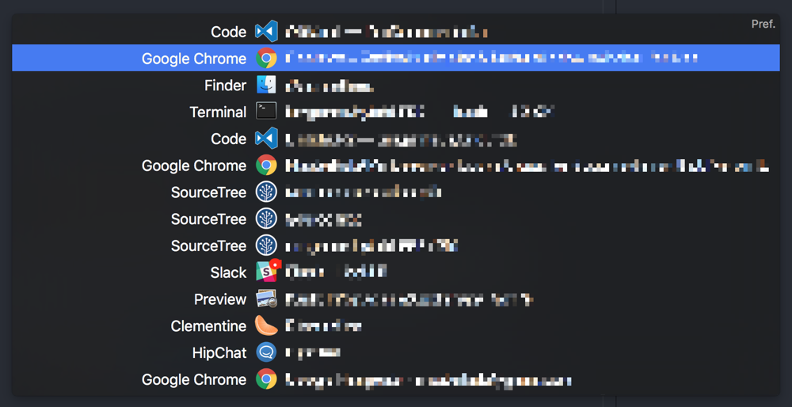
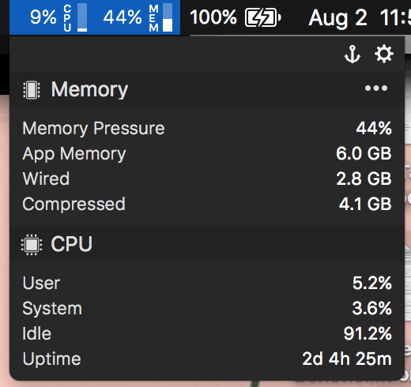

# OSX Tips and Tricks

Things I've discovered that fix some of OSX's rough edges

## Tips

### Quick Look

Tapping `space` when a file is selected in Finder will open that file via **Quick Look**. This will open a popup with a preview of the contents of the file. See the **Quick Look Plugins** section below for additional plugins that can increase the number of files that are supported by this feature.

When opening files from within an application via the file dialogue, such as when selecting a file to upload from within Chrome, you can use Quick Look to see a larger version of a thumbnail before selecting a file.

### Screenshots

You can specify a new location for screenshots to be saved with the following command:

```sh
$ defaults write com.apple.screencapture location ~/Screenshots
```

`~/Screenshots` can be substituted out for another directory. From that point on, screenshots taken with **Cmd+Shift+3** or **Cmd+Shift+4** will be saved to that location.

### Finder - Hidden Files

You can toggle the visibility of hidden files (a.k.a. **dotfiles**) using **Cmd+Shift+.**. However, if you always want hidden files to be visible in Finder, you can specify that with `defaults`:

```sh
$ defaults write com.apple.finder AppleShowAllFiles YES
```

Afterwards, hold the **Option** key, **right-click** the Finder icon, then click **Relaunch**. The next time you open a Finder window you should see hidden files.


## Additional Software

Unless otherwise mentioned, licenses for software below that's _not_ free are either in my password locker, or the software was purchased and can be reinstalled via the App Store.

### [Homebrew](https://brew.sh/)

It's a matter-of-course that you need to install Homebrew on OSX. Don't fight it, just install it - the homepage will have the most up-to-date installation method.

Afterwards you can do cool things like painlessly install Python3:

```sh
$ brew install python3
```

### [Quick Look Plugins](https://github.com/sindresorhus/quick-look-plugins)

This repo details several useful plugins that enhance OSX's "Quick Look" feature (press `space` while a file is selected in Finder). The repo's README lists a quick "install all" list of plugins, but I've narrowed it down to the following:

```sh
$ brew cask install qlcolorcode qlstephen qlmarkdown quicklook-json qlprettypatch quicklook-csv qlimagesize webpquicklook suspicious-package qlvideo
```

Simply put, this increases the variety of files that can be previewed via Quick Look.

### [BetterTouchTools](https://www.boastr.net/)

BTT allows me to quickly set up Windows-esque window positioning via `Ctrl + Arrow Keys`. It also gained clipboard history support, you can bind it to Mouse6 (provided you clear the default Mission Control binding from the mouse via the Logitech Options applications).

### [Contexts](https://contexts.co/)

Contexts gives me a Windows-esque window switcher when I switch between windows using Cmd+Tab. Instead of having to switch between programs and then windows within that program, I can access any open window via a popup like this:



### [MenuBar Stats](https://seense.com/menubarstats/)

MenuBar Stats provides an XFCE-esque system resource monitor that sits in the menu bar. I like to keep track of CPU and RAM consumption, and this works perfectly for that:



### [Sound Control](https://staticz.com/soundcontrol/)

OSX disables volume control when you specify an HDMI monitor to handle audio output. Fortunately the Sound Control application exists to address this issue. Keyboard volume controls work as expected, and it's painless to switch input and output audio devices in case you need to switch over to a headset. Per-application volume control is also supported after purchasing a license.
