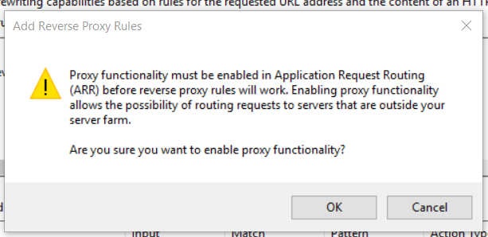

Setting up a Reverse-Proxy in IIS
===================

[TOC]

## Download Microsoft Web Platform Installer 5.0

The installer can be downloaded from here: http://www.microsoft.com/web/downloads/platform.aspx

## Install required IIS modules
### Application Request Routing 3.0

Open the Web Platform Installer (WPI) and search for '**Application Request Routing 3.0**'. Click **Add** to add the module to your installation queue.

### Install URL Rewrite 2.0

Still within WPI, search for '**URL Rewrite 2.0**'. As with the above plugin, click **Add** to add this module to your installation queue as well.

Once these two modules have been added, click the Install button, then I Accept. WPI should now download and install both modules.

## Verify installation of the modules

Relaunch the IIS management console and look for the '**URL Rewrite**' module on your sites and directories.

## Set up a reverse proxy

- Click Directory
- Click URL Rewrite
- Right-click -> Add Rule
- Select 'Reverse Proxy'
	- If prompted to enable proxy functionality in Application Request Routing, click OK
	
-  In the *Inbound Rules* text box, enter the address you want to proxy connections to then click OK
	- e.g. 'localhost:8000'

## Troubleshooting
### 'URL Rewrite' icon is missing from a site or folder

Try repairing both modules from Windows' Programs and Features window

- Start Menu > 'Programs and Features'
- Repair 'IIS URL Rewrite Module 2'
- Repair 'Microsoft Application Request Routing 3.0'