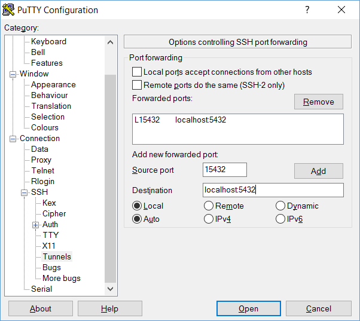

Using PuTTY to tunnel to a remote PostgreSQL server
===============================

[TOC]

## Prerequisites

This guide is intended for admins using PuTTY on Windows. If you don't already have it installed, PuTTY can be downloaded here:

* http://www.chiark.greenend.org.uk/~sgtatham/putty/download.html

Admins on a Linux OS can get away with using the built-in **ssh** tool and the following command:

> ssh -L 2222:localhost:5432 user@server-ip

Where **-L** indicates a port on your local machine, **2222** is the local port to bind to, and **localhost:5432** is the port that you want to tunnel from your remote server. **user@server-ip** is your authentication username and the remote IP address/URL of your server. 

However, if you're on Linux and would prefer to work with a GUI then PuTTY can also be installed via your distro's software repos.

## Set up an SSH connection in PuTTY

Set up a connection to your server as you would with any other SSH connection. 

## Set up the tunnel

Our ultimate goal is to access a PostgreSQL instance running on a remote server *without* exposing the server to the internet. Fortunately PuTTY makes this easy. Start by entering in your connection information, or loading a saved session.

Next, on the **left-hand side** of the PuTTY window, click Connection > SSH > Tunnels.

In the **Source Port** text box, enter the desired local port to which you want to map the tunneled connection. This is the **port on your local machine** from which your remote PostgreSQL instance will be accessible.

Next, in the **Destination** text box, enter "**localhost:**" followed by the remote port your PostgreSQL instance is running on. Typically, this will be **5432**.

You also want to make sure that your destination is a **Local** destination.

Once you've entered all of this information, **click the Add button**. Finish up by returning to Session (on the left-hand side) and **saving your session**.

## Open your remote connection

Connect to your remote server. Enter whatever credentials or certificate passwords you need to authenticate and establish a secure connection.

## Connect to your remote database instance through the tunnel

Via your PostgreSQL management application of choice, create a new database connection. Use the following information as a guide when filling in connection information:

* Server: localhost
* Port: 15432
* Username: &lt;DB username&gt;
* Password: &lt;DB password&gt;

Save this new connection, and you're done! Your database will be accessible on that port for as long as your SSH session is open (basically, until you close PuTTY).

# Final Words

This guide focuses on connecting to a remote instance of PostgreSQL, but this technique will work to expose *any* remote service to your computer as though it were running locally on your machine. You just need to know what port the service is listening to on the server and choose a local port to bind the tunnel to. Then, when you run through this guide, substitute "5432" with whatever is your service's remote port.